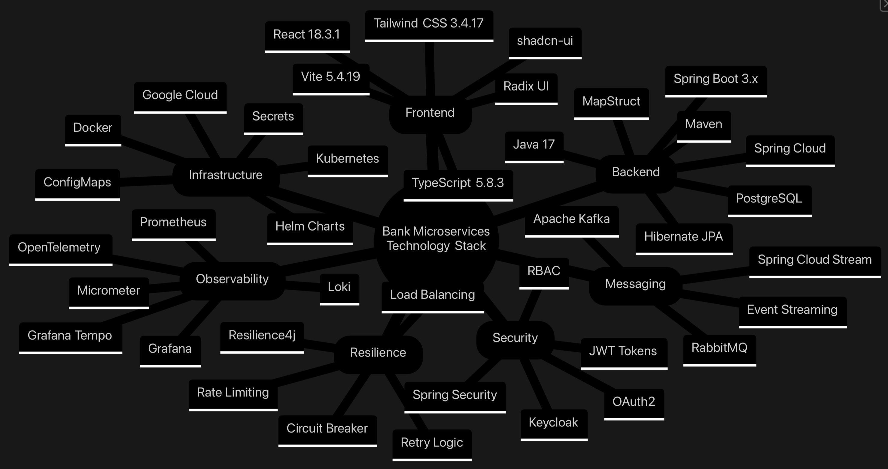
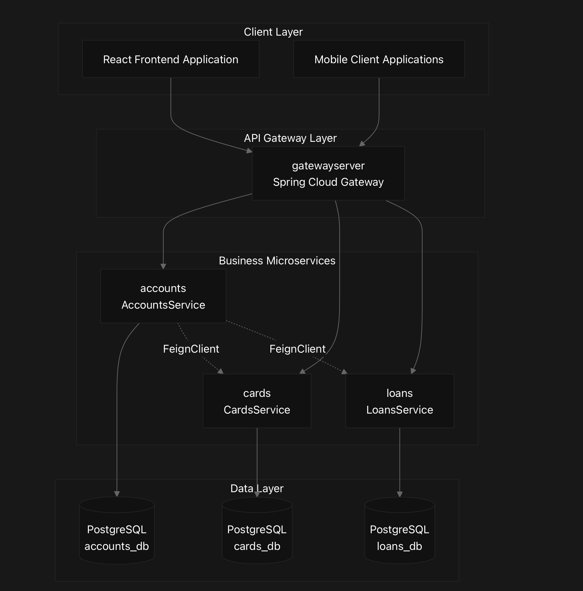

# Bank Microservices 

This document provides a high-level introduction to the Bank Microservices system, a comprehensive distributed banking application built using Spring Boot and Spring Cloud technologies.


# Tech Stack Overview




# System Overview

The Bank Microservices system is a production-ready distributed banking platform that demonstrates modern microservices architecture patterns. The system provides complete banking functionality including account management, card services, and loan processing through independently deployable microservices.
The platform serves as both a functional banking application and a reference implementation showcasing enterprise-grade microservices patterns such as service discovery, API gateway, distributed configuration, circuit breakers, and comprehensive observability.


---

## 📚  Coverage

- ✅ Microservices architecture fundamentals
- ✅ Spring Boot microservices development
- ✅ REST API design and best practices
- ✅ Inter-service communication: REST & Feign Client
- ✅ Service discovery with **Eureka**
- ✅ API Gateway with **Spring Cloud Gateway**
- ✅ Centralized configuration with **Spring Cloud Config Server**
- ✅ Fault tolerance & resilience with **Resilience4j**
- ✅ Distributed tracing with **Grafana**
- ✅ Logging and monitoring with **Loki** and **Prometheus**
- ✅ Dockerization of microservices using **Docker**
- ✅ Orchestration with **Kubernetes**
- ✅ ConfigMaps, Secrets, Deployments, and Services in Kubernetes
- ✅ Load balancing & scaling microservices
- ✅ CI/CD concepts with microservices deployment on **Google Cloud**

- **Temperory Frontend created**
---

## 🧩 Technology Stack

The system leverages a **modern technology stack** designed for **cloud-native microservices development**.

---

### ⚙️ Backend Technologies
- **Java 17** – Core programming language  
- **Spring Boot** – Application framework for REST APIs, Spring Data JPA, Spring Web  
- **Spring Cloud** – Microservices infrastructure (Eureka, Config Server, Gateway, OpenFeign)  
- **Resilience4j** – Circuit breaker, retry, and rate-limiting patterns  
- **MapStruct** – DTO mapping framework  
- **PostgreSQL** – Primary database for all business services  

---

### 🔗 Communication & Messaging
- **REST APIs** – Synchronous service communication  
- **OpenFeign** – Declarative REST client using `@FeignClient`  
- **Apache Kafka** – Event streaming platform (KRaft mode)  
- **RabbitMQ** – Message broker for event-driven architecture  
- **Spring Cloud Stream** – Messaging abstraction layer  

---

### 🔒 Security & Authentication
- **OAuth2** – Authentication and authorization protocol  
- **Keycloak** – Identity and access management provider  
- **JWT Tokens** – Token-based authentication  

---

### 📊 Observability Stack
- **Grafana** – Visualization and dashboarding  
- **Prometheus** – Metrics collection and monitoring  
- **Loki** – Log aggregation system  
- **Grafana Tempo** – Distributed tracing  
- **OpenTelemetry** – Observability instrumentation  

---

## 🧠 Key System Capabilities

The system implements comprehensive **enterprise-grade capabilities** across multiple domains.

---

### 📡 API Management
- Centralized API routing through **Spring Cloud Gateway**  
- Request/response logging and tracing with **custom filters**  
- **Rate limiting** using Redis-based rate limiter  
- Cross-cutting concerns implemented at **gateway level**  

---

### 🛡️ Resilience Patterns
- **Circuit Breaker** – Implemented with Resilience4j for failure isolation  
- **Retry Logic** – Automatic retry mechanisms for transient failures  
- **Rate Limiting** – Request throttling to prevent system overload  
- **Timeout Configuration** – Configurable timeouts for service calls  

---

### ⚙️ Configuration Management
- **Externalized configuration** using Spring Cloud Config Server  
- **Environment-specific profiles** (dev, qa, prod)  
- **Git-based configuration storage** with encryption support  
- **Automatic configuration refresh** capabilities  

---

### 🔐 Security Implementation
- **OAuth2 Client Credentials Grant Flow** – For service-to-service communication  
- **Authorization Code Grant Flow** – For user authentication  
- **Role-Based Access Control (RBAC)** – Implemented via Keycloak integration  
- **API security enforcement** at gateway level  

---

## 🔄 Communication Patterns

The system implements both **synchronous** and **asynchronous** communication models to handle various interaction types.

---

### 🔁 Synchronous Communication
- **REST APIs** – Standard HTTP-based service communication  
- **Feign Client** – Declarative REST client with `@FeignClient` annotations  
- **Service Discovery** – Dynamic service location via **Eureka registration**  
- **Load Balancing** – Client-side load balancing using **Spring Cloud LoadBalancer**  

---

### ⚡ Asynchronous Communication
- **Event-Driven Architecture** – Loose coupling through messaging  
- **Apache Kafka** – High-throughput event streaming (KRaft mode)  
- **RabbitMQ** – Message queuing for event handling  
- **Spring Cloud Stream** – Messaging abstraction with functional programming model  
- **StreamBridge** – Two-way communication between services  

---

## ☁️ Deployment Models

The system supports **multiple deployment strategies**, from local development to full cloud-native production.

---

### 💻 Local Development
- **Docker Compose** – Single-command local environment setup  
- **Development Profiles** – Environment-specific configurations  
- **Hot Reloading** – Apply code changes without restarting  

---

### 🧱 Container Orchestration
- **Docker** – Containerized microservices using multi-stage builds  
- **Kubernetes** – Production-grade orchestration  
- **Helm Charts** – Package management for Kubernetes deployments  
- **ConfigMaps & Secrets** – Kubernetes-native configuration management  

---

### 🌐 Cloud Deployment
- **Google Kubernetes Engine (GKE)** – Managed Kubernetes in Google Cloud  
- **Kubernetes-native Service Discovery** – Server-side discovery  
- **Horizontal Pod Autoscaling** – Auto-scaling based on metrics  
- **Rolling Updates** – Zero-downtime deployment strategy  

---

## 🏗 Microservices Overview

### 1. **Accounts Service**
- Handles **customer account creation, updates, and retrieval**.
- Stores account details in its own **PostgreSQL** database.
- Exposes REST endpoints for account operations.

### 2. **Cards Service**
- Handles **credit/debit card issuance and management**.
- Each customer can have multiple cards.
- Independent **PostgreSQL** database.

### 3. **Loans Service**
- Manages **loan creation, updates, and retrieval**.
- Supports multiple loan types.
- Independent **PostgreSQL** database.

### 4.**API Gateway**
- Routes requests to backend microservices
- Central entry point for the system
- Configured with filters for logging and authentication (future-ready)

### 5. **Eureka Server**
- Service registry for dynamic service discovery

### 6. **Config Server**
- Centralized configuration management for all services
- Stores configs in Git repository

### 7. **Messaging**
- Asynchronous messaging using Kafka / RabbitMQ
-  **Producer & Consumer Microservices** using Spring Cloud Stream


---

### 🎯 Core Features

### ✅  CRUD Operations in Accounts,Loans and Cards Service
- Created JPA Entities and Repositories
- DTO pattern introduction and implementation
- Implemented:
  - Springboot layered Architecture
  - Multiple Crud API
  - Detaild Response Structures for Error and Success Responses
- Global exception handling
- Auto-update of audit fields (created_at, updated_at)

### ✅ API Documentation using Springdoc OpenAPI
- Integrated Swagger UI with Springdoc
- Used annotations:
  - `@OpenAPIDefinition`
  - `@Tag`, `@Operation`, `@ApiResponse`, `@Schema`
- Enhanced auto-generated documentation


### ✅ Dockerizing Microservices
- Dockerfile created for each service
- Generated Docker images locally
- Ran containers using Docker CLI
- Introduced Buildpacks and compared with Dockerfile approach
- Docker image push to DockerHub

### ✅ Spring Boot Profiles and Configuration Management
- Added `dev`, `qa`, and `prod` Spring profiles
- Externalized configs using:
  - `@Value`
  - `Environment`
  - `@ConfigurationProperties`
- Activated profiles using command-line/JVM/environment variables

### ✅ Spring Cloud Config Server
- Built `config-server` with Spring Cloud Config
- Externalized properties to file system and Git
- Implemented:
  - Created **common configurations** for all microservices
  - Encryption/decryption of config properties
  - Auto-refresh via `/actuator/refresh`
  - Spring Cloud Bus for distributed refresh
- Updated docker-compose for config server integration

### ✅ Integrating MySQL Database
- Replaced H2 DB with MySQL for all services
- Dockerized MySQL containers
- Created schema and updated entity configurations
- Demonstrated Docker networking with services + DB containers
- Added uptil this in seperate git branch use s7 image from docker hub

### ✅ Service Discovery with Eureka
- Implemented `eureka-server`
- Registered `accounts`, `loans`, `cards` microservices to Eureka
- Replaced static URLs with service names
- Feign client integration for service-to-service calls
- Eureka client deregistration on shutdown
- Docker-based setup:
- Docker `s8` version images

### ✅ API Gateway using Spring Cloud Gateway
- **Created Gateway microservice using Spring Cloud Gateway**
- Configured default and custom routing for internal services
- Added response headers using filters
- Implemented cross-cutting concerns: logging and tracing at the gateway
- Discussed design patterns used in API Gateway
- Docker-based setup:
- Docker `s9` version images

### ✅ Making Microservices Resilient
- Introduced need for resiliency and typical failure scenarios
- Implemented:
  - **Circuit Breaker pattern (Gateway + Feign)**
  - **Retry pattern (Accounts)**
  - **Rate Limiting using Redis RateLimiter (Gateway + Accounts) using bucket algorithm**
- Configured timeouts and aspect order for resilience
- Docker-based setup:
- Docker `s10` version images

### ✅ Observability and Monitoring
- Concepts of **observability, centralized logging, and monitoring**
- Setup and integrated:
  - Logging: Grafana + Loki + Promtail
  - Metrics: Micrometer + Prometheus + Grafana Dashboards
  - Alerts: Grafana alerting with 2 approaches
  - Tracing: OpenTelemetry + Grafana Tempo
- Implemented log tracing, metrics collection, and distributed tracing end-to-end
- Docker-based setup:
- Docker `s11` version images

###  ✅Microservices Security with OAuth2 & Keycloak
- Implementing OAuth2 and OpenID Connect:
- Implemented **Client Credentials Grant Flow**:
  - Keycloak setup and client registration
  - Gateway server secured as a **Resource Server**
  - Access tokens fetched and validated
  - Role-based authorization enforced inside the gateway
- Implemented **Authorization Code Grant Flow**:
  - User and client setup in Keycloak
  - Full login flow with token issuance and validation
  - Role-based access control using Keycloak roles and scopes
- **Secured all microservices through API Gateway**
- Docker-based setup:
- Docker `s12` version images

### ✅ Event-Driven Microservices with Spring Cloud Stream & RabbitMQ
- Implemented **Event-Driven Architecture** using RabbitMQ as a message broker
- Developed **Message Microservice** using Spring Cloud Function:
  - Functional-style `@Bean` consumers for event handling
  - Used `StreamBridge` to publish events
- Updated **Message & Accounts Microservices** to support **2-way communication**:
  - `message` microservice publishes events consumed by `accounts`
  - `accounts` microservice processes those events and responds with its own events
  - Enabled full **bi-directional asynchronous communication**
- Used **Spring Cloud Stream** for messaging abstraction:
  - Configured bindings to connect microservices with RabbitMQ
- Demonstrated **Asynchronous Communication** between services:
  - Verified end-to-end message flow via RabbitMQ exchanges and queues
- Docker-based setup:
- **Docker**: `s13` version images used

### ✅ Event-Driven Microservices with Spring Cloud Stream & Apache Kafka (KRaft Mode)

- Compared **Apache Kafka vs RabbitMQ** for event-driven architecture:
  - Kafka: log-based, distributed, high-throughput message streaming (KRaft mode – no Zookeeper)
- Implemented **Asynchronous Event Streaming** using Kafka (KRaft mode)
- Developed **Producer & Consumer Microservices** using Spring Cloud Stream:
  - Functional-style `@Bean` consumers for clean message processing
  - Used `StreamBridge` to publish events to Kafka topics
- Enabled **end-to-end async communication**:
  - `producer-service` sends events to Kafka topic
  - `consumer-service` consumes and processes those events
- Configured **Spring Cloud Stream Kafka Binder**:
  - Defined topic bindings and Kafka broker settings in `application.yml`
- Docker-based setup:
- **Docker**: `s14` version images used

### ✅ Kubernetes Basics & Local Setup
- Solved to **container orchestration challenges** and using Kubernetes
- Implemented **Kubernetes internal architecture** (API Server, etcd, Scheduler, Controller Manager, Kubelet, etc.)
- Installed and set up a **local Kubernetes cluster** using Docker Desktop
- Deployed and accessed the **Kubernetes Dashboard UI** for cluster management

---

### ✅ Deploying Microservices in Kubernetes
- Created **Kubernetes YAML manifest files** to deploy microservices
- Deployed **Config Server** into Kubernetes cluster
- Created and used **ConfigMaps** for environment variables inside Kubernetes
- Prepared manifests for Accounts, Loans, and Cards microservices
- Implemented **Automatic Self-Healing** in Kubernetes pods
- Configured **Automatic Rollouts and Rollbacks** for zero-downtime deployments
- Explored **Kubernetes Service types** (ClusterIP, NodePort, LoadBalancer) with demos

---

### ✅ Helm Package Manager Integration
- Implemented **Helm** 
- Installed **Helm CLI** and explored Helm chart structure
- Created **custom Helm charts** for:
  - Accounts microservice
  - Loans, Cards, Config Server, and other supporting services
- Created environment-specific Helm charts (**Dev**, **QA**, **Prod**)
- Used important Helm commands:
  - `helm template` for manifest previews
  - `helm install` for deployments
  - `helm upgrade` for rolling updates
  - `helm history` & `helm rollback` for version control
  - `helm uninstall` for cleanup

---

### ✅ Deploying Supporting Services with Helm
- Installed **Keycloak** in Kubernetes using Helm
- Installed **Kafka** in Kubernetes using Helm
- Installed **Prometheus**, **Grafana**, **Loki**, and **Tempo** for observability
- Deployed **Bank microservices** via Helm charts in Kubernetes

---

### ✅ Kubernetes-native Service Discovery & Load Balancing
- Implemented  **server-side service discovery** in Kubernetes
- Installed **Spring Cloud Kubernetes Discovery Server** in K8s cluster
- Made **Discovery Client changes** in microservices to use Kubernetes-native service resolution
- Updated Helm charts to include Discovery Server configuration
- Verified **load balancing** and service discovery within Kubernetes

---

### ✅ Cloud Deployment on Google Kubernetes Engine (GKE)
- Set up **Google Cloud account** and installed Google Cloud SDK
- Created **Kubernetes cluster** in Google Cloud
- Installed all microservices and supporting services (Keycloak, Kafka, Grafana, Prometheus, etc.) on GKE
- Verified **Grafana dashboards, metrics, and traces** in the cloud environment
- Demonstrated complete **Bank microservices** setup running on GKE
- Deleted Google Cloud Kubernetes cluster to avoid unnecessary costs


---

## 📦 How to Run

```bash
# Step 1: Select containers based on features 
dockerhub URL: https://hub.docker.com/repositories/vighneshkt
docker-compose up --build
